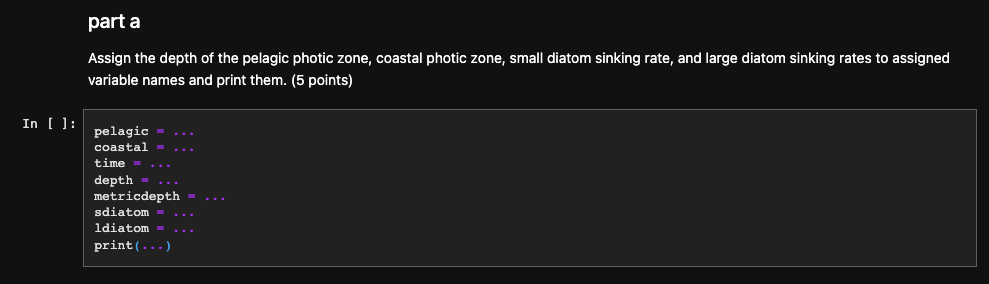

# Homework #1

**Due: Friday Oct. 13th @ 11:59 pm**

**Objective:** This assignment will give you experience using a Jupyter notebook to write text and code, including variables, mathematical operations, string, and list manipulations.


## **Instructions:**
### Accessing Class Code

1. Create a new private repository on your GitHub account and name it "homework_1". This will be your personal GitHub repository that you will submit to Gradescope. **DO NOT** initialize your repository with a README! This will create a different commit than the repository you will eventually push to your GitHub and create conflicts, so please make sure it is completely empty to start with.

2. Go to the class GitHub Homework 1 [repository](https://github.com/OCEAN-215-2023/homework_1). 

3. Find the **SSH** URL (review Assignment #0b if you don't remember how to do this), and copy the URL to your clipboard.

4. In your JupyterHub terminal, change to your home directory. Run this line of code to clone the public classic repository into your local server: 
``` git clone git@github.com:OCEAN-215-2023/homework_1.git ```

5. Sometimes, our JupyterHub server has trouble remembering the file permissions for our SSH keys. If you get a file permission error with your private ssh key, run this line of code:
```chmod 400 ~/.ssh/id_ed25519``` 
<br>

This will change your file permission to the proper permissions that SSH requires.

6. There should now be a "homework_1" directory in the home directory of your JupyterHub. In terminal, change directories into "homework_1". Next, click on the the "homework_1" icon on the filepath hierarchy in the left panel of JupyterHub. If you don't see it, make sure you're in the home folder by clicking the folder icon under the search bar. 

7. In terminal, set your branch to main (step 17 in #0b) and your remote (origin) to your **_personal_** "homework_1" GitHub repository (step 18). Use these lines of code (you will only need to do these steps once to set up in the beginning): 
``` git init ``` <br>
``` git branch -M main``` <br>
``` git remote set-url origin __your_ssh_url_here__```

To check if your remote origin is set correctly, run: <br>
``` git remote -v ```

You should see an SSH URL with your GitHub username. 

8. Double click the "HW1.ipynb" to open it in a new tab and begin working on the assignment. Read the instructions carefully, and make sure to write your answers in the specified cells. Typically, you will see a "..." in the places you need to fill in. Make sure to use the variable names provided in the starter code. See the "Working in your Notebook" section below for an example.

9. Create a README file and write your name and UW NetID. Include a paragraph of instructions on how you used git commands to add, commit, and push to your repository (3-5 sentences). Now that y'all are GitHub connoisseurs, imagine that you are explaining how to use GitHub to someone who has never used GitHub before! :) 

10. As you continue to answer the homework questions and make edits to your code, make sure to regularly update your GitHub repository as well via git add, commit, and push (steps 15, 16, 19 in 0b). A good rule of thumb would be to run these git steps anytime you make an addition or change that you don't want to accidentally lose. Generally, you can push once a day to maintain good version control practices. <br>
As a note, make sure that your git commands are running without errors before you refresh your GitHub and check your changes. If you are not seeing the updated changes you created in your local JupyterHub directory, check where your status is by this command: <br>
``` git status```

Then, you can see if you made an error with your git add, commit, or push commands. 
    
### Submitting to GradeScope

11. Go to the class Gradescope dashboard and submit your **_private_** GitHub repository link to Homework 1 assignment. Make sure your GitHub is synchronized with Gradescope to access both your public _and_ private repositories. If prompted, log in to GitHub.

12. Run the autograder to check if your code runs and if you passed the initial unit tests. You should be able to run the autograder as many times as you want before submitting. Again, double check that your final answers are stored in the provided variable names given in the starter code!

13. Once the autograder has finished running, check that you have submitted the assignment. If you make any more changes to your code after submitting to Gradescope, make sure to push your changes to GitHub and resubmit the assignment on Gradescope. You can submit as many times as you want as there is no maximum submission attempts, but be sure to have your final submission in before the deadline.

### Working in your Notebook
    
   To help you start thinking about how to write meaningful and concise variable names, we have provided variable names in most of your questions. For example, "pelagic" and "coastal" are variable names in Question 2a to describe different oceanic zones you will be comparing. <br>

    Note that there is an ellipsis (the "...") after each of the variable names. These are the sections you are expected to fill in. Please use the provided variable names (ie "pelagic" and "coastal" in the above example) to report your final answer back in. This will ensure that the autograder on Gradescope runs properly. <br>
    <br>Make sure that you are adding comments and your outside references as you go along! Part of your grade will include using best coding practices in your homework assignments. 

### Honor Code

- Complete the assignment by writing and executing text and code cells as specified. For this assignment, do not use any features of Python that have not yet been discussed in the lessons or class sessions.

- Please keep in mind our late work and dropped homework grading policy. Review the syllabus for details.

- You can acknowledge and describe any assistance you've received on this assignment in the specified cell of the HW1 notebook, whether that was from an instructor, classmate (either directly or on Piazza), and/or online resources other than official Python documentation websites like docs.python.org or numpy.org. Alternatively, if you prefer, you may acknowledge assistance at the relevant point(s) in your code using a Python comment (#). Don't forget that you can receive extra credit from answering at least one question on Ed Discussion!